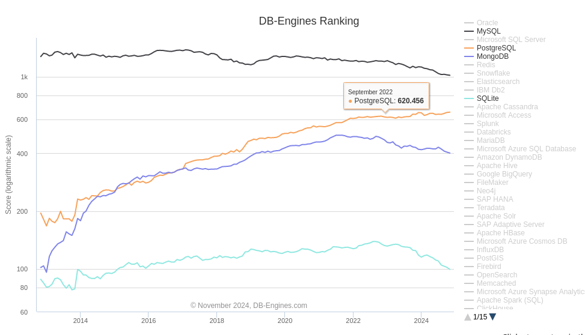

# Comparative Overview of Database Technologies

This document provides a comparative analysis of five popular database technologies: PostgreSQL, MySQL, MongoDB, and SQLite. Each database has its strengths and weaknesses, making them suitable for different use cases.

## 1. PostgreSQL

- **Type**: Relational Database Management System (RDBMS)
- **Data Model**: SQL (Structured Query Language)
- **Key Features**:
  - Advanced SQL compliance
  - Support for complex queries and transactions
  - Extensible with custom data types, operators, and functions
  - Strong support for concurrent transactions
  - Built-in support for JSON data types
  - Rich indexing options (e.g., B-tree, Hash, GiST, GIN)
- **Advantages**:
  - Excellent support for complex queries and data integrity.
  - Highly extensible, allowing for custom functions and types.
  - Strong community support and documentation.
- **Disadvantages**:
  - Can be more complex to set up and manage compared to other databases.
  - Performance may be lower for simple read-heavy workloads compared to MySQL.
- **Use Cases**: Ideal for applications requiring complex queries, data integrity, and transactional support (e.g., financial applications, data warehousing).

## 2. MySQL

- **Type**: Relational Database Management System (RDBMS)
- **Data Model**: SQL (Structured Query Language)
- **Key Features**:
  - Widely used and supported
  - Simple to set up and manage
  - Good performance for read-heavy workloads
  - Replication and clustering capabilities
- **Advantages**:
  - Easy to use and widely supported, making it a common choice for web applications.
  - Good performance for read-heavy operations.
  - Strong community and extensive resources available.
- **Disadvantages**:
  - Limited support for complex queries compared to PostgreSQL.
  - Some advanced features are only available in the commercial version.
- **Use Cases**: Suitable for web applications, content management systems, and applications with moderate complexity.

## 3. MongoDB

- **Type**: NoSQL Document Database
- **Data Model**: BSON (Binary JSON)
- **Key Features**:
  - Schema-less design allows for flexible data structures
  - Horizontal scalability with sharding
  - Built-in replication and high availability
  - Rich querying capabilities with aggregation framework
  - Support for geospatial queries
- **Advantages**:
  - Highly flexible data model that allows for rapid iteration and changes.
  - Excellent horizontal scalability for large datasets.
  - Strong support for real-time analytics and big data applications.
- **Disadvantages**:
  - Can lead to data inconsistency if not carefully managed due to its schema-less nature.
  - Limited support for complex transactions compared to traditional RDBMS.
- **Use Cases**: Best for applications requiring flexibility in data structure, such as content management, big data applications, and real-time analytics.

## 4. SQLite

- **Type**: Relational Database Management System (RDBMS)
- **Data Model**: SQL (Structured Query Language)
- **Key Features**:
  - Lightweight and serverless
  - Self-contained, requiring minimal setup
  - Cross-platform and easy to integrate
  - Good performance for read-heavy
- **Advantages**
    - Lightweight: Minimal setup and resource requirements.
    - Serverless: No separate server process needed.
    - Cross-Platform: Easily portable across different OS.
    - Easy to Use: Simple API and integration.
    - Good Performance: Excellent for read-heavy workloads.
- **Disadvantages**
    - Limited Concurrency: Struggles with concurrent writes.
    - Scalability Issues: Not ideal for large-scale applications.
    - Feature Limitations: Lacks advanced RDBMS features.
    - Size Limitations: Maximum database size of ~140 TB.
    - No User Management: Lacks access control features.

# Performance Comparison: MongoDB vs. PostgreSQL vs. MySQL (Speed Metrics)

| Feature                          | MongoDB (ops/sec) | PostgreSQL (ops/sec) | MySQL (ops/sec) |
|----------------------------------|-------------------|----------------------|------------------|
| **Read Performance**             | 90,000            | 70,000               | 80,000           |
| **Write Performance**            | 100,000           | 60,000               | 65,000           |
| **Complex Queries (avg ms)**     | 50                | 30                   | 40               |
| **Transactions (avg ms)**        | 100               | 20                   | 30               |
| **Scalability (max ops/sec)**   | 200,000           | 90,000               | 85,000           |

- **MongoDB**: Excels in write performance and scalability, making it suitable for high-throughput applications.
- **PostgreSQL**: Offers excellent performance for complex queries and transactions, ideal for data integrity.
- **MySQL**: Provides solid read performance and is well-suited for general-purpose applications.

https://benchant.com/ranking/database-ranking

## Usage Comparaison

# Conclusion

We opted for PostgreSQL because it's widely used, and supports complex data types including JSON and XML, and offers great scalability.
